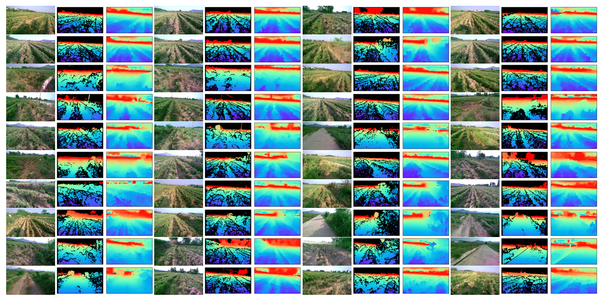
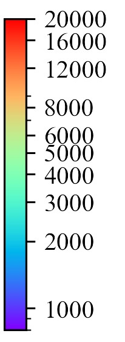

# 这是一个专门用于田间定位的视觉神经网络模型，
我们采集了田间的数据，并制作了数据集，最后训练好的模型的效果是输入图片就能得到这张图片中的空间信息。
模型的配置文件为[binsformer_swinl_22k_NYU_416x544.py](binsformer_swinl_22k_NYU_416x544.py "binsformer_swinl_22k_NYU_416x544.py")，训练方法和[mmsegmentation](https://github.com/open-mmlab/mmsegmentation "mmsegmentation")一样。
## 以下是模型推理结果的展示

第一列是输入模型的图片
第二列是深度相机采集的标签   
第三列是模型推理结果   

**颜色对应的距离如下图所示,单位为mm**   

## 最近更新 2024.10.09

## 模型权重, 敬请期待
